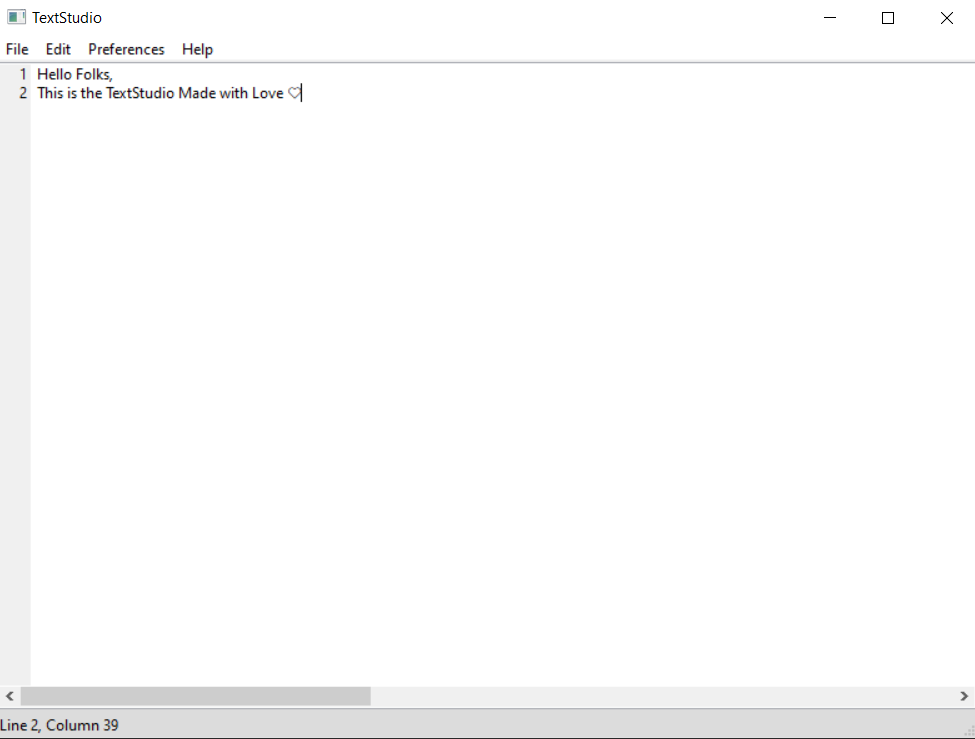

# TextStudio

- Simple But Advanced TextEditor built using Python3 and wxpython.

# Module Used
- wx &nbsp; ```pip3 install -U wxpython```
- os

# How To Run
- ``` python TextStudion.py```

# Functionality
- Create New Document
- Open Document
- Save and Save As Document
- Exit
- Undo, Redo, Select All, Copy, Cut, Paste, Preferences, Help

# KeyBoard Shortcuts
- New File = &nbsp;```ctrl + n```
- Open File = &nbsp; ```ctrl + o```
- Save File = &nbsp;```ctrl + s```
- Save As File = &nbsp;```alt + s```
- Exit TextStudio = &nbsp;```ctrl + w```
- How To = &nbsp;```F1```
- About = &nbsp;```F2```

# ScreenShot


# Author
- D H R U V &nbsp; P R A J A P A T I

# Thank You!